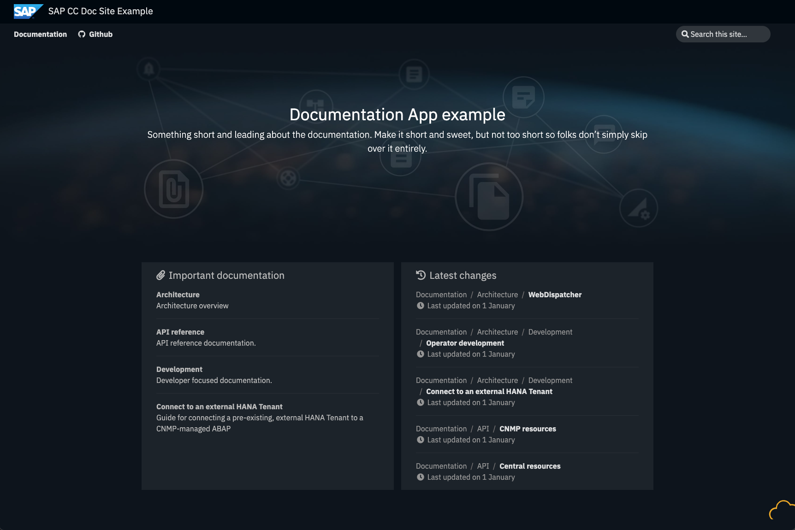
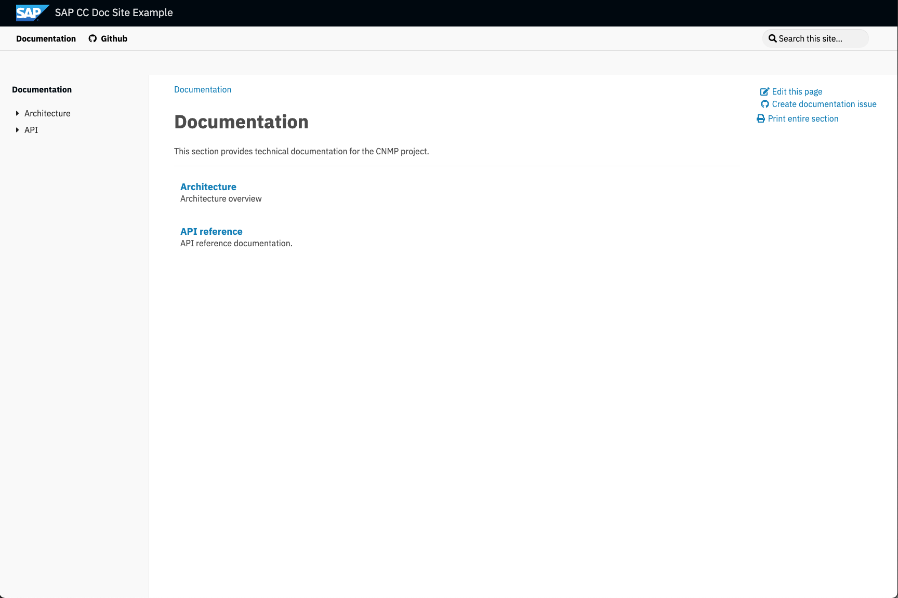
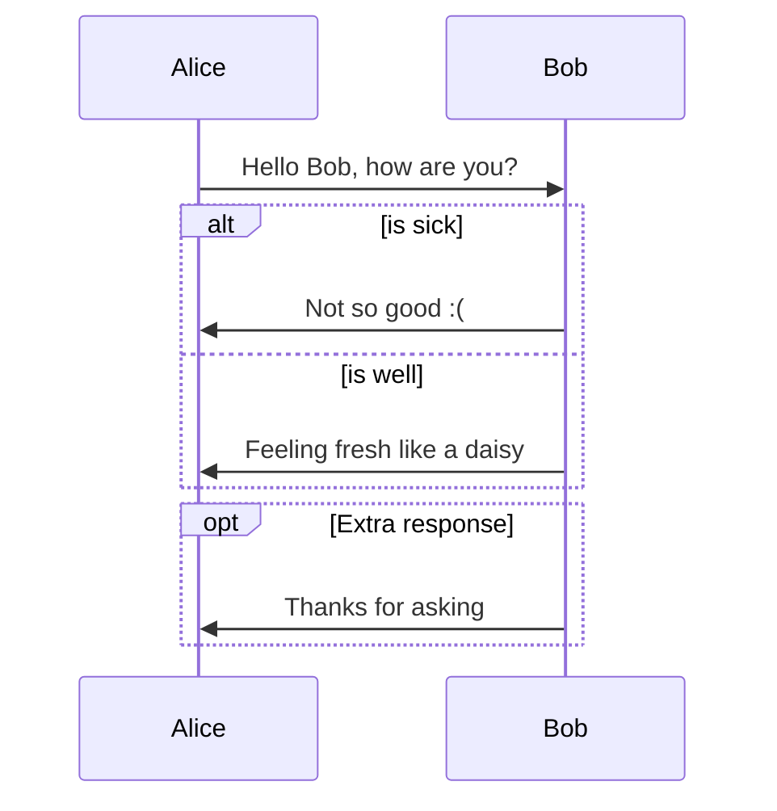

# Welcome to the Hugo Documentation Templater

[](LICENSE)

This guide shows you how to use this templater to create a technical documentation site that already comes with a custom theme. Here's what the result looks like:

Custom landing page:



Documentation page:



## Live Example

Check out this documentation templater in action with its Markdown helpers, tools, and extensions at the following [link](https://sapcc.github.io/hugo-documentation-templater/).

## 🚨 Major Upgrade to V3 🚨

**⚠️ Attention:** This release requires **Hugo v0.128** or higher. Running it with an older version is not supported and will not work with v3. This release introduces support for BPMN diagrams and numerous improvements and bug fixes.

Please see [Upgrade to V3](#upgrade-to-v3) for detailed instructions on how to upgrade your site to v3.

## Release Notes

- Introduces support for BPMN diagrams. For more details, refer to the [diagrams section](https://sapcc.github.io/hugo-documentation-templater/docs/markdown-helpers/#diagrams).
- Removed deprecated code to maintain compatibility with Hugo versions v0.128 and higher.
- Ensured compatibility with the latest Hugo version.
- Upgraded Docsy to version v0.11.0.
- Fixed load of drawio diagrams when base URL is different of the root URL.
- The `Create documentation issue` link now includes the page source URL, which will be displayed in the description of the GitHub issue.

## Create a New Documentation Site from Scratch

### Install Hugo Extended Version

Please refer to the official Hugo documentation for more details on [how to install Hugo in other operating systems](https://gohugo.io/installation).

Prerequisite: Golang

#### Mac Users

```
brew install golang
brew install hugo
```

To verify your new install:

```
hugo version
```

### Create a Hugo Site

```
hugo new site my-docu-site
cd  my-docu-site
```

### Convert Your Site into a Hugo Module

You can convert your site into a Hugo module using the `hugo mod init <module path>` command.

```
hugo mod init github.com/sapcc/my-docu-site
```

The Go `<module path>` should resolve to a valid VCS (Version Control System) repository, such as Git, allowing others to use your site as a dependency. If your site's source code is not available in a public VCS repository, you can use a single word as the Go module path.

### Declare the `hugo-documentation-templater` Module as a Dependency for Your Site

To add the templater (`hugo-documentation-templater`) module as a dependency, use the following command:

```
hugo mod get github.com/sapcc/hugo-documentation-templater/v3@v3.0.0
```

If you are developing this module locally, add the following configuration to your go.mod file to redirect to your local folder:

```go.mod
module github.com/me/my-docu-site

// just for local dev add this line (adjust to your folder location)!
replace github.com/sapcc/hugo-documentation-templater/v3 => /Users/d063222/Documents/sap/cc/hugo-documentation-templater

go 1.20

require github.com/sapcc/hugo-documentation-templater/v3 v3.0.0 // indirect
```

### Update the Hugo Config to Import the Templater

To import the templater, add the necessary settings to the `config.yaml` file in the `imports` section:

```yaml
baseURL: "http://example.org/"
languageCode: "en-us"
title: "My New Doc Site"

params:
  # change this url to the one of your project to enable 'View page source', 'Edit this page' and 'Create documentation issue' links on the right side navigation
  github_repo: "https://github.com/sapcc/your-repo-pointing-to-the-documentation"

menu:
  # uncomment this section to add custom links to the top navigation
  # main:
  #   - identifier: "Github"
  #     name: "Github"
  #     pre: "<i class='fab fa-github'></i>"
  #     url: "https://github.com/sapcc/your-repo-pointing-to-the-documentation"
  #     weight: 0

module:
  hugoVersion:
    extended: true
    min: 0.73.0
  imports:
    - path: github.com/sapcc/hugo-documentation-templater/v3
      disable: false
```

### Start Hugo Server

```
hugo server --disableFastRender --ignoreCache
```

The `--disableFastRender` enables full re-renders on changes.
The `--ignoreCache` ignores the cache directory.

### Troubleshooting Application Start Errors

If you encounter any errors when starting the application, try running the following command to clean up the cache and remove unused modules:

```bash
hugo mod clean
hugo mod tidy
```

After running the cleanup command, restart the Hugo server as described in the previous section. If you still encounter issues, try deleting the public folder and then restart the server.

## Content and Customization

### Site Name

Edit the name attribute on the Hugo config file `config.yaml`.

```yaml
title: "My New Doc Site"
```

### Add Non-content Entries to a Menu

Add a menu configuration similar to the following in the `config.yaml` (see [Hugo documentation](https://gohugo.io/content-management/menus/)):

```yaml
menu:
  main:
    - identifier: "Github"
      name: "Github"
      pre: "<i class='fab fa-github'></i>"
      url: "https://github.com/sapcc/your-repo-pointing-to-the-documentation"
      weight: 0
```

### Print Option

Add to the `config.yaml` following setting to display the print link:

```yaml
outputs:
  section:
    - HTML
    - print
```

### Landing Page

#### Customize Hero Section

### Customizing the Landing Page

To customize the landing page, add a file named \_index.md to the root of the `content` folder. These are available attributes you can use to customize the hero section:

```markdown
---
heroTitle: "The best documentation ever"
heroSubtitle: "This is the subtitle of the hero section"
heroImage: "images/custom-hero-image.jpg"
heroButtonTitle: "Documentation"
heroButtonLink: "docs/customer"
---
```

#### Configure the Latest Changes Section on the Landing Page

To display recent file changes in your documentation content as they are committed to GitHub, you just need to configure the number of changes to be shown. Add the following configuration to your `config.yaml` to activate this section:

```yaml
params:
  # number of file changes to be displayed in the landing page.
  recentDocChanges: 10
```

#### Configure the News Section on the Landing Page

To display recent blog posts on the landing page as they are committed to GitHub, you need to activate this section by specifying the number of blog posts to show. Add the following configuration to your `config.yaml` file:

```yaml
params:
  # number of last blog posts to be displayed in the landing page.
  recentBlogPosts: 5
```

#### Add a Custom Section Index for Navigation

To enable a custom section index that allows users to jump to specific documentation sections from the landing page, add the `landingSectionIndex: true` parameter to the `_index.md` file of the desired section.

Example:

If you have an architecture folder with a section definition file located at `content/docs/architecture/_index.md`, you should include the `landingSectionIndex: true` parameter as shown below:

```markdown
---
title: "Architecture"
linkTitle: "Architecture"
weight: 1
landingSectionIndex: true
description: >
  Architecture overview
---
```

A new entry will be added at the bottom of the landing page, featuring links and descriptions to help users navigate directly to the desired sections.

Here’s an improved version of the text along with the Markdown code:

#### Configure an Overview Section for the Landing Page

Set up an overview section on the landing page by configuring the relevant settings. You can customize this section using the provided configuration options.

Configuration description:

```yaml
params:
  overviewSection: <[]Object>
    label: <string>
    icon: <string>
    links: <[]Object>
      - label: <string>
        path: <string>
```

Example:

```yaml
params:
  # overview section configuration
  overviewSection:
    - label: Compute
      icon: "fa-server"
      links:
        - label: Servers
          path: "/docs/customer/compute/virtual-servers/"
        - label: "Block Storage"
          path: "/docs/customer/compute/block-storage/"
    - label: Networking
      icon: "fa-wifi"
      links:
        - label: Jump Servers
          path: "/docs/customer/networking/jump-servers/"
        - label: "Load Balancer"
          path: "/docs/customer/networking/load-balancers/"
```

#### Create a Custom Landing Page Content Template

1. Create a new file for your landing page content, e.g., `landing-page-new-content.html`, and save it in the `partials` folder.
2. This content will be automatically inserted between the `<main>` tags on the landing page.

```html
<main>{{/* Your custom content here from the partial */}}</main>
```

3. Reference the new content file in your `config.yaml` configuration file:

```yaml
params:
  # Specify the landing page content template
  landingPageContentTemplateName: "landing-page-new-content"
```

#### Style Your Custom Landing Page

1. Create a file named `custom-styles.scss` in the `assets/scss` folder.
2. Add your styles using the following example:

```css
/* Example of defining variables in Sass and reading parameters from the config */
$heroImage: unquote(
  '{{ default "images/Hero_background.jpg" .Params.heroImage }}'
);

/* Set up a new CSS class and use the variable in it */
.custom-jumbotron {
  background: var(--color-global-bg) url($heroImage) top center no-repeat;
}
```

#### Adding Custom Code to the Head Section

To insert custom code (such as CSS imports, cookie consent scripts, or similar) into the head section of the landing page, include the `landing-page-head-custom.html` partial.

### Documentation

#### Content

Simply organize your documentation into folders under `content/docs/`. Each folder should include a `_index.md` file with the following information:

```markdown
---
title: "Main title of the section"
linkTitle: "Name on the side navigation"
weight: "integer number describing the position in the side bar"
description: >
  "Some description useful"
---
```

#### Search

Search engine and field in the top navigation bar is setup per default. Search field on the right side navigation is per default disabled.

#### Diagram Mermaid

Original documentation: <https://geekdocs.de/shortcodes/mermaid/>

Live Editor to test diagrams: <https://mermaid-js.github.io/mermaid-live-editor>

````tpl

````


#### Using Diagrams from diagrams.net (previously draw.io)

To incorporate diagrams created with [diagrams.net](https://www.drawio.com/) into your documentation, follow these steps:

1. **Save the Diagram**:

   - Create your diagram in [diagrams.net](https://www.drawio.com/).
   - Save it in the `.drawio` format:
     - Go to `File` -> `Save as`.
     - Select `Format: XML File (.drawio)`.

2. **Push the File**:

   - After creating your `.drawio` file, push it to the desired location in your repository.

3. **Include the Diagram**:

   - To use the diagram in your document, include it with the absolute path as shown below:

   ```tpl
   
   ```

By following these steps, you can easily include and display your `draw.io` diagrams in your documentation. See example below:


#### Diagram Nomnoml

Nomnoml is a tool for creating UML diagrams using a straightforward syntax. For more information, visit the [Nomnoml website](https://www.nomnoml.com/) or check out the [GitHub repository](https://github.com/skanaar/nomnoml).

Example:

```nomnoml
[Pirate|eyeCount: Int|raid();pillage()|
 [beard]--[parrot]
 [beard]-:>[foul mouth]
]
[<abstract>Marauder]<:--[Pirate]
[Pirate]- 0..7[mischief]
[jollyness]->[plunder]
[jollyness]->[rum]
[jollyness]->[singing]
[Pirate]-> *[rum|tastiness: Int|swig()]
[Pirate]->[singing]
[singing]<->[rum]
[<start>st]->[<state>plunder]
[plunder]->[<choice>more loot]
[more loot]->[st]
[more loot] no ->[<end>e]
[<actor>Sailor] - [<usecase>shiver me;timbers]
```


#### BPMN

`bpmn-js` is a library for rendering and interacting with BPMN 2.0 diagrams directly in the browser. Further details can be found at https://bpmn.io/toolkit/bpmn-js/ or the GitHub repository.

Example:

```bpmn

```


## Extra Information

### Bootstrap Version

Based on Bootstrap 5.3.3

### Build Assets

Creating a new package.json file
https://docs.npmjs.com/creating-a-package-json-file

```

npm init

```

Install PostCSS so that the site build can create the final CSS assets
https://github.com/google/docsy#prerequisites

```

npm install --save-dev autoprefixer
npm install --save-dev postcss-cli

```

### Git Information

https://www.dinofizzotti.com/blog/2017-05-01-adding-hugo-version-and-commit-information-to-a-status-page/
https://sizeof.cat/post/git-info-on-a-hugo-static-website/

### Upgrade to V3

1. Update the hugo version:

```bash
brew upgrade hugo
```

2. Update the hugo-documentation-templater module version:

```bash
hugo mod get github.com/sapcc/hugo-documentation-templater/v3@v3.0.0
```

3. Update the `config.yaml` file to include the new module path and if not yet change the hugo version to 0.128.0:

```yaml
...
module:
  hugoVersion:
    extended: true
    min: 0.128.0
  imports:
  ...
    - path: github.com/sapcc/hugo-documentation-templater/v3
      disable: false
```

4. Clean up the cache and remove unused modules:

```bash
hugo mod clean
hugo mod tidy
rm -rf public
```

#### SAP Assets Module

To add the SAP assets module install the module with the following command:

```bash
hugo mod get github.com/sapcc/hugo-documentation-templater-sap-assets@v1.0.2
```

You should see the following in your go.mod file:

```
require (
  github.com/sapcc/hugo-documentation-templater-sap-assets v1.0.2 // indirect
  ...
)
```

**Remember that the sap-assets-module should be added in the first line in the config.yaml file:**

```yaml
...
module:
  imports:
    - path: github.com/sapcc/hugo-documentation-templater-sap-assets
      disable: false
    ...
```
