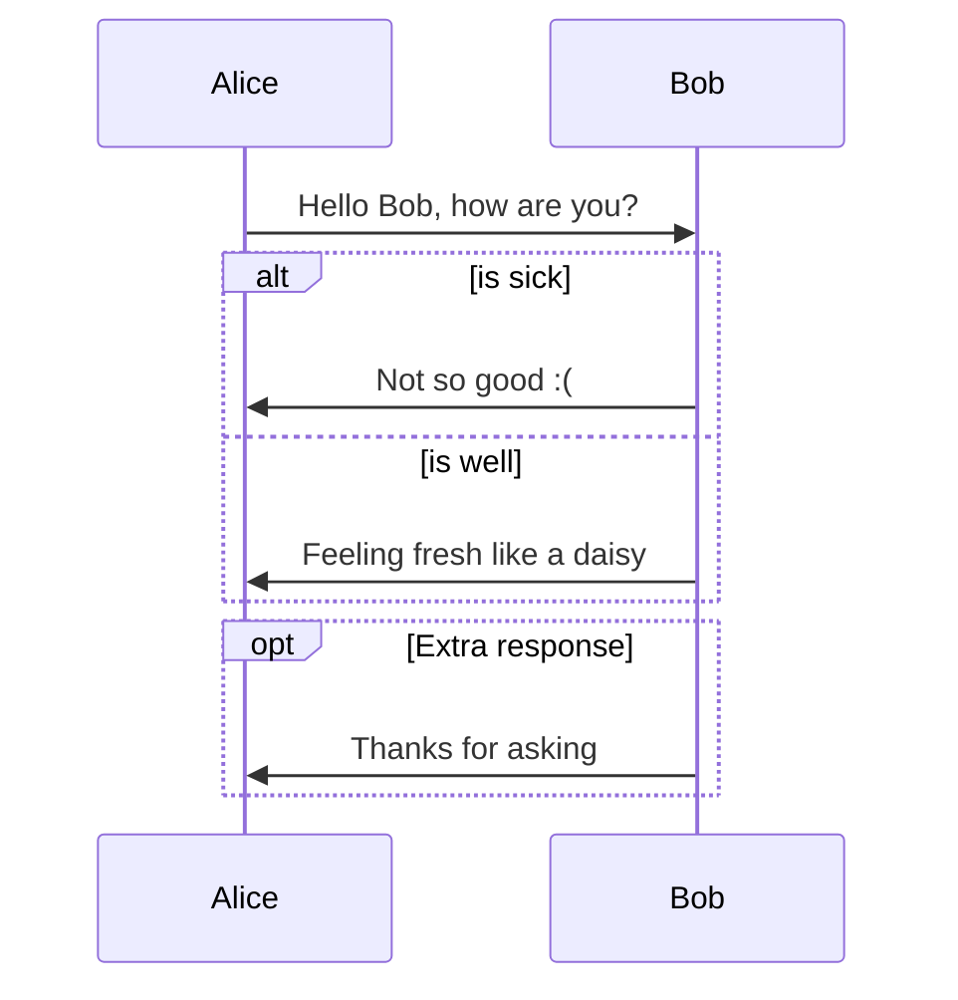

# Welcome to the Hugo documentation templater

This guide shows you how to use this templater to create a Converged Cloud technical documentation site. But before you keep reading have a look at our beauty:

Custom landing page:


Documentation page:


## Create a new documentation site from scratch

### Install Hugo extended version

Prerequisite: Golang

#### Mac users

```
brew install golang
brew install hugo
```

To verify your new install:

```
hugo version
```

### Create a Hugo site

```
hugo new site my-docu-site
cd  my-docu-site
```

### Turn your site into a Hugo Module

```
hugo mod init github.com/sapcc/my-docu-site
```

### Declare the hugo-documentation-templater module as a dependency for your site

Normally you would add the sapcc docs templater (hugo-documentation-templater) module as following:

```
hugo mod get github.com/sapcc/hugo-documentation-templater@v1.1.0
```

But if you are developing this module add the following config to the go.mod file and it will redirect to your local folder:

```go.mod
module github.com/me/my-docu-site

// just for local dev add this line (adjust to your folder location)!
replace github.com/sapcc/hugo-documentation-templater => /Users/d063222/Documents/sap/monsoon/hugo-documentation-templater

go 1.17

require github.com/sapcc/hugo-documentation-templater v1.1.0 // indirect
```

### Edit the Hugo config file `config.yaml` (originally is `config.toml` but I prefer yaml) as following to import the templater:

```yaml
baseURL: "http://example.org/"
languageCode: "en-us"
title: "My New SAP CC Doc Site"

params:
  # change this url to the one of your project to enable 'View page source', 'Edit this page' and 'Create documentation issue' links on the right side navigation
  github_repo: "https://github.com/sapcc/your-repo-pointing-to-the-documentation"

menu:
  # uncomment this section to add custom links to the top navigation
  # main:
  #   - identifier: "Github"
  #     name: "Github"
  #     pre: "<i class='fab fa-github'></i>"
  #     url: "https://github.com/sapcc/your-repo-pointing-to-the-documentation"
  #     weight: 0

module:
  hugoVersion:
    extended: true
    min: 0.73.0
  imports:
    - path: github.com/sapcc/hugo-documentation-templater
      disable: false
```

### Start Hugo Server

```
hugo server --disableFastRender
```

The `--disableFastRender` option ensures that nothing is cached.

### Errors

If you have any errors when starting the application try running following command to clean up the cache:

```bash
hugo mod clean
```

Afterwards start again the Hugo server as described in the section below.

## Content and Customization

### Site name

Edit the name attribute on the Hugo config file `config.yaml`.

### Add Non-content Entries to a Menu

Add a menu configuration similar to the following in the `config.yaml` (see [Hugo documentation](https://gohugo.io/content-management/menus/)):

```yaml
menu:
  main:
    - identifier: "Github"
      name: "Github"
      pre: "<i class='fab fa-github'></i>"
      url: "https://github.com/sapcc/your-repo-pointing-to-the-documentation"
      weight: 0
```

### Print option

Add to the `config.yaml` following setting to display the print link:

```yaml
outputs:
  section:
    - HTML
    - print
```

### Landing page

#### Customize hero section

Add a file named `_index.md` to the root of content folder with following content to customize the landing page:

```markdown
---
heroTitle: "The best documentation ever"
heroSubtitle: "This is the subtitle of the hero section"
---
```

#### Configure the latest changes section in the landing page

Display the recent file changes of the documentation content as they are committed in github. To activate this section enter the number of file changes to be shown in the section adding following configuration to the `config.yaml`:

```yaml
params:
  # number of file changes to be displayed in the landing page.
  recentDocChanges: 10
```

#### Configure the news section in the landing page

Display the recent news from the blog section as they are committed in github. To activate this section enter the number of blog posts to be shown by adding following configuration to the `config.yaml`:

```yaml
params:
  # number of last blog posts to be displayed in the landing page.
  recentBlogPosts: 5
```

#### Add custom section index to jump to specific documentation sections in the landing page

Add this parameter `landingSectionIndex: true` to the `_index.md` file of the desired section or markdown file.

Example:
Given an architecture folder with the section definition file `content/docs/architecture/_index.md` with parameter `landingSectionIndex: true` as following:

```markdown
---
title: "Architecture"
linkTitle: "Architecture"
weight: 1
landingSectionIndex: true
description: >
  Architecture overview
---
```

A new entry will be created in the section at the bottom of the landing page with links and descriptions to jump directly to the desired sections.

#### Configure an overview section for the landing page

Display an overview index section based on a configuration

Configuration description:

```yaml
params:
  overviewSection: <[]Object>
    label: <string>
    icon: <string>
    links: <[]Object>
      - label: <string>
        path: <string>
```

Example:

```yaml
params:
  # overview section configuration
  overviewSection:
    - label: Compute
      icon: "fas fa-paperclip"
      links:
        - label: Servers
          path: "/docs/customer/compute/virtual-servers/"
        - label: "Block Storage"
          path: "/docs/customer/compute/block-storage/"
    - label: Networking
      icon: "fas fa-paperclip"
      links:
        - label: Jump Servers
          path: "/docs/customer/networking/jump-servers/"
        - label: "Load Balancer"
          path: "/docs/customer/networking/load-balancers/"
```

#### Create an own landing page content template

1. Create a file with the landing page content (`landing-page-new-content.html`) and save it in the `partials` folder.
2. The content will be automatically added between the <main> tags in the landing page.

```html
<main>{{/* your own content here coming from the partial */}}</main>
```

3. Reference the landing page content file in the configuration file `config.yaml`

```yaml
params:
  # landing page content template
  landingPageContentTemplateName: "landing-page-new-content"
```

### Documentation

#### Content

Just drop your documentation well organized in folders under `content/docs/`. Each folder should contain a `_index.md` file containing following information:

```markdown
---
title: "Main title of the section"
linkTitle: "Name on the side navigation"
weight: "integer number describing the position in the side bar"
description: >
  "Some description useful"
---
```

#### Search

Search engine and field in the top navigation bar is setup per default. Search field on the right side navigation is per default disabled.

#### Diagram Mermaid

Original documentation: <https://geekdocs.de/shortcodes/mermaid/>

Live Editor to test diagrams: <https://mermaid-js.github.io/mermaid-live-editor>

````tpl

````


#### Diagram draw.io / diagrams.net

To use diagrams created with `draw.io` you need to save the it in the `.drawio` format.

`File` -> `Save as` -> `Format: XML File (.drawio)`

After you have created your `.drawio` file you have to push it to the desired location.

Now to use the diagram you will have to include it in your document with the absolute path like this:

```tpl

```


#### Diagram Nomnoml

Nomnoml is a tool to draw UML diagrams based on a simple syntax. Further details can be obtained at <https://www.nomnoml.com/> or the [github repo](https://github.com/skanaar/nomnoml).

Example:

```nomnoml
[Pirate|eyeCount: Int|raid();pillage()|
 [beard]--[parrot]
 [beard]-:>[foul mouth]
]
[<abstract>Marauder]<:--[Pirate]
[Pirate]- 0..7[mischief]
[jollyness]->[plunder]
[jollyness]->[rum]
[jollyness]->[singing]
[Pirate]-> *[rum|tastiness: Int|swig()]
[Pirate]->[singing]
[singing]<->[rum]
[<start>st]->[<state>plunder]
[plunder]->[<choice>more loot]
[more loot]->[st]
[more loot] no ->[<end>e]
[<actor>Sailor] - [<usecase>shiver me;timbers]
```


## Extra information

### Bootstrap version

Based on Bootstrap 4.6

### Buil assets

Creating a new package.json file
https://docs.npmjs.com/creating-a-package-json-file

```

npm init

```

Install PostCSS so that the site build can create the final CSS assets
https://github.com/google/docsy#prerequisites

```

npm install --save-dev autoprefixer
npm install --save-dev postcss-cli

```

### Git Information

https://www.dinofizzotti.com/blog/2017-05-01-adding-hugo-version-and-commit-information-to-a-status-page/
https://sizeof.cat/post/git-info-on-a-hugo-static-website/

```

```
