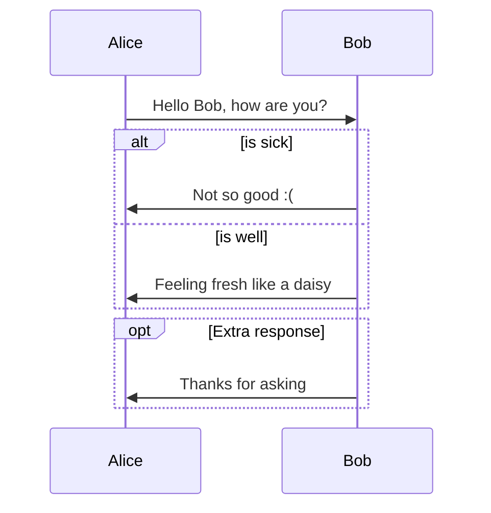

This section serves as a quick reference for users already familiar with Markdown, offering a reminder of its core syntax. Additionally, it describes the tools and extensions provided by this templater that enhance standard Markdown, allowing you to create more dynamic and engaging documentation.

## Cheat Sheet

````shell
## Text Formatting

_italic_
**bold**
~~strikethrough~~

## Headings

# Heading 1

## Heading 2

### Heading 3

## Bulleted Lists

- Item 1
- Item 2
- Item 3

## Numbered Lists

1. Item 1
2. Item 2
3. Item 3

## Links

[Link Text](URL)

## Images


## Code Blocks

To create a code block in Docsy, use three backticks followed by the language identifier:

```python
print("Hello, World!")
```

## Inline Code

Use single backticks (`) to mark inline code.

## Tables

| Column 1  | Column 2  |
| --------- | --------- |
| Content 1 | Content 2 |
| Content 3 | Content 4 |

## Blockquotes

> This is a blockquote.

## Horizontal Lines

---

## Comments

<!-- This is a comment and will not be displayed. -->

## Escape Characters

Use the backslash (\) to escape special characters that are Markdown syntax characters.

## Docsy-Specific Extensions

Docsy provides additional features and extensions specifically designed for documentation with Docsy. Refer to the Docsy documentation for more information.
````

## Enhanced Guide: In-Depth Explanation

### Front Matter

The _front matter_ is the metadata attached to e.g. markdown files. It can be formatted in TOML, YAML or JSON — in these docs YAML is used. This should be continued for consistency.

Example:  
This is the front matter used in this article:

```yaml
---
title: Markdown Helpers
weight: 2
tags: ["contribution", "markdown", "helpers"]
---
```

[More details from hugo documentation](https://gohugo.io/content-management/front-matter/)

### Headings

Headings should be used to structure documents in semantically useful parts. The _primary heading_ is set by the [frontmatter]() and should **not** be used inside the document.

#### Anchors

Headings generally create anchors that can be referenced as described in [link help](). Anchors are lowercase, spaces are replaced by `-` and if it is not unique suffixed by `-NUMBER` (`NUMBER` replaced of course).

If some heading should have a non-generated anchor it can be overwritten/specified by a special suffix like  
`## Heading 2 {#some-other-string}`or `## Headings 2 {id="something-different"}`

| Markdown               | Rendered Output            |
| ---------------------- | -------------------------- |
| # Heading level 1      | `<h1>Heading level 1</h1>` |
| ## Heading level 2     | `<h2>Heading level 2</h2>` |
| ### Heading level 3    | `<h3>Heading level 3</h3>` |
| #### Heading level 4   | `<h4>Heading level 4</h4>` |
| ##### Heading level 5  | `<h5>Heading level 5</h5>` |
| ###### Heading level 6 | `<h6>Heading level 6</h6>` |

### Tags

Just adopt the File header by `category` and a `tags` array to add them.

Example:

```yaml
---
title: "SEM - Playbooks"
description: "This documentation contains the SEM playbooks"
categories: ["Security"]
tags: ["Security management", "Security", "SEM", "Playbooks"]
---
```

An overiew can be found on the internal [tag page]().

Please consider to limit the ammount of labels.

### Blockquotes

Markdown uses `>` (greater than) characters for blockquoting.

> Lorem ipsum dolor sit amet, consectetuer adipiscing elit.
> Aliquam hendrerit mi posuere lectus.
>
> Donec sit amet nisl. Aliquam semper ipsum sit amet velit. Suspendisse
> id sem consectetuer libero luctus adipiscing.

```markdown
> Lorem ipsum dolor sit amet, consectetuer adipiscing elit.
> Aliquam hendrerit mi posuere lectus.
>
> Donec sit amet nisl. Aliquam semper ipsum sit amet velit. Suspendisse
> id sem consectetuer libero luctus adipiscing.
```

Blockquotes can be nested.

> Lorem ipsum dolor sit amet, consectetuer adipiscing elit.
>
> > Aliquam hendrerit mi posuere lectus. Donec sit amet nisl.
>
> Suspendisse id sem consectetuer libero luctus adipiscing.

```markdown
> Lorem ipsum dolor sit amet, consectetuer adipiscing elit.
>
> > Aliquam hendrerit mi posuere lectus. Donec sit amet nisl.
>
> Suspendisse id sem consectetuer libero luctus adipiscing.
```

### Code Blocks

````md
This is a code block created by three backticks ("code fences") ``` - each on its own line.

It is also possible to use indentation by at least one tab (or 4 spaces).

This method with backticks is strongly preferred as it is much more explicit and less error prone than an indentation.
````

In Markdown this would look like this:

````text
```
This is a code block.
```
````

This is an example for `inline code`.

In Markdown this would look like this:

```markdown
This is an example for `inline code`.
```

#### Syntax Highlighting

Original documentation: <https://gohugo.io/content-management/syntax-highlighting/#highlight-shortcode>

To enable syntax highlighting the language of the block has to be specified.
Additionally various options can be added (see further down).

````markdown
```xml
<somthing></something>
```
````

> Options:
>
> - `linenos`: configure line numbers. Valid values are `true`, `false`, > `table`, or `inline`. `false` will turn off line numbers if it's configured > to be on in site config. `table` will give > copy-and-paste friendly code blocks.
> - `hl_lines`: lists a set of line numbers or line number ranges to be > highlighted.
> - `linenostart=199`: starts the line number count from 199.
> - `anchorlinenos`: Configure anchors on line numbers. Valid values are `true` > or `false`;
> - `lineanchors`: Configure a prefix for the anchors on line numbers. Will be > suffixed with `-`, so linking to the line number 1 with the option > `lineanchors=prefix` adds the anchor `prefix-1` to the page.

#### Highlighting in Code Fences

Highlighting in markdowns' code fences is also possible:

````text
```go {linenos=table,hl_lines=[2,4]}
// ... code
```
````

Creates:

```go {linenos=table,hl_lines=[2,4]}
// comment
// If an unknown or empty style is provided, AP style is what you get.
func GetTitleFunc(style string) func(s string) string {
  switch strings.ToLower(style) {
  case "go":
    return strings.Title
```

#### Highlighting with Shortcode

```text

// ... code

```


// comment
// If an unknown or empty style is provided, AP style is what you get.
func GetTitleFunc(style string) func(s string) string {
switch strings.ToLower(style) {
case "go":
return strings.Title


#### Example of a Highlighted Code Block with Line Numbers, Highlighted Lines and highlighting dot

The following is an extensive example demonstrating various features. Line numbers are displayed, and lines 3, 4, 15, and 16 are highlighted to make two code snippets more visible. Additionally, the first snippet is marked with a dot to further enhance its visibility.

````text
```react {linenos=true,hl_lines=[3,4,15,16],linenostart=1}
// App.jsx
const App = (props = {}) => {
  1
  useUrlState(props?.id || "doop") 

  return (
    <MessagesProvider>
      <AppShell
        pageHeader={`Doop`}
        contentHeading={`Decentralized Observer of Policies  ${
          props.displayName ? ` - ${props.displayName}` : ""
        }`}
        embedded={props.embedded === true}
      >
      2
      <AsyncWorker consumerId={props.id || "doop"} />
      [...]
      </AppShell>
    </MessagesProvider>
  )
}
```
````

Creates:

```react {linenos=true,hl_lines=[3,4,15,16],linenostart=1}
// App.jsx
const App = (props = {}) => {
  1
  useUrlState(props?.id || "doop") 

  return (
    <MessagesProvider>
      <AppShell
        pageHeader={`Doop`}
        contentHeading={`Decentralized Observer of Policies  ${
          props.displayName ? ` - ${props.displayName}` : ""
        }`}
        embedded={props.embedded === true}
      >
      2
      <AsyncWorker consumerId={props.id || "doop"} />
      [...]
      </AppShell>
    </MessagesProvider>
  )
}
```

### Emphasis

- _single asterisks_
- **double asterisks**

In markdown:

```markdown
_single asterisks_
**double asterisks**
```

To produce a literal asterisk or underscore at a position where it would otherwise be used as an emphasis delimiter, you can backslash escape it.

### Diagram

**draw.io / diagrams.net**

To use diagrams created with `draw.io` you need to save the it in the `.drawio` format.

`File` -> `Save as` -> `Format: XML File (.drawio)`

After you have created your `.drawio` file you have to push it to the desired location.

Now to use the diagram you will have to include it in your document with the absolute path like this:

```tpl

```



### Hints

Create a color-coded box.

```tpl

**Markdown content**\
Dolor sit, sumo unique argument um no. Gracie nominal id xiv. Romanesque acclimates investiture.
 Ornateness bland it ex enc, est yeti am bongo detract re.

```

Examples:


**\*\*Info: Markdown content\*\***\
Dolor sit, sumo unique argument um no. Gracie nominal id xiv. Romanesque acclimates investiture.
Ornateness bland it ex enc, est yeti am bongo detract re.



Success



Warning



Danger



Default



White


### Images

You can do it in different ways

#### 1. with `figure` (recommended)

```tpl

```

Don't add an empty `title=""` to a `{{ figure }}` if you dont provide a proper alt/subtext
If the pics are in a subfolder, just write `src="your-directory/monsoon_logo.png"`

Further [examples and additional formatting options](https://gohugo.io/content-management/shortcodes/#figure) in the hugo documentation.

#### 2. Markdown

Alternative syntax is pur Markdown - which is not recommended as it

- is not properly styled
- does not show a caption for the image
- won't work inside lists and code blocks

```markdown

```

#### 3. Hugo Image Processing

[Hugo image processing.](https://gohugo.io/content-management/image-processing/)

Further [examples and other options](https://gohugo.io/content-management/shortcodes/#figure) in the hugo documentation.

### Labels / Badges

Create a color-coded inline box.

Add any of the below mentioned modifier classes to change the appearance of a label.

```tpl
example success

example danger

example warning

example info

example dark
```

Examples:

example success

example danger

example warning

example info

example dark

### Links

#### Link Markup

Markdown supports various link types, the most commonly is an _inline link_. Other more complex variants are explained in the [commonmark spec](https://spec.commonmark.org/0.29/#links).

##### Inline Links

This is an example inline link: [sap.com](https://www.sap.com)

```markdown
This is an example inline link: [sap.com](http://www.sap.cpm)
```

##### Anchors

If you want to jump to a specific heading on a page, you can reference [anchors]().

This is [an example](#ref) reference-style link.

```markdown
This is [an example](#ref) reference-style link.
```

#### Internal Links

Internal links should be created with a special shortcode:

This is [a link]() inside the docs. The first argument is the filename that should be linked. Hugo will try to find the proper file+path by itself. If two files have the same name you have to specify the path as the pages will not be generated otherwise.

The file extension is not required.

```tpl
This is [a link]() inside the docs.
This is [a link]() inside the docs which would not work as it is ambiguous.
This is [a link]() inside the docs with full path to the document.
```

### Lists

Markdown supports ordered (numbered) and unordered (bulleted) lists.

Don't add empty lines inside a list or it will create a new list for each point

#### Unordered List

- 1st item
- 2nd item
  - 1st sub-item of 2nd item
- 3rd item

```markdown
- 1st item
- 2nd item
  - 1st sub-item of 2nd item
- 3rd item
```

#### Ordered List

1. 1st item
2. 2nd item
3. 3rd item

```markdown
1. 1st item
1. 2nd item
1. 3rd item
```

Notice the actual value of the number doesn't matter in the list result. However, using the proper number improves readability.

#### Combined List

- Item 1
- Item 2
  1. Subitem 1
  2. Subitem 2
- Item 3

```markdown
- Item 1
- Item 2
  1. Subitem 1
  1. Subitem 2
- Item 3
```

### Paragraphs

A paragraph is one or more consecutive lines of text separated by one or more blank lines.

This is the first paragraph.

This is the second paragraph.

```markdown
This is the first paragraph.

This is the second paragraph.
```

### Tables

```markdown
| State     | Description                     |
| --------- | ------------------------------- |
| Queued    | Lorem ipsum dolor sit amet, ... |
| Executing | Lorem ipsum dolor sit amet, ... |
| Failed    | Lorem ipsum dolor sit amet, ... |
| Complete  | Lorem ipsum dolor sit amet, ... |
```

| State     | Description                     |
| --------- | ------------------------------- |
| Queued    | Lorem ipsum dolor sit amet, ... |
| Executing | Lorem ipsum dolor sit amet, ... |
| Failed    | Lorem ipsum dolor sit amet, ... |
| Complete  | Lorem ipsum dolor sit amet, ... |

For more complex tables (e.g. multiple paragraphs in one cell) you will have to use HTML markup in your Markdown document.

### Diagrams

#### Mermaid

Original documentation: <https://geekdocs.de/shortcodes/mermaid/>

Live Editor to test diagrams: <https://mermaid-js.github.io/mermaid-live-editor>

````tpl

````


#### Nomnoml

Nomnoml is a tool to draw UML diagrams based on a simple syntax. Further details can be obtained at <https://www.nomnoml.com/> or the [github repo](https://github.com/skanaar/nomnoml).

Example:

````tpl
```nomnoml
[Pirate|eyeCount: Int|raid();pillage()|
 [beard]--[parrot]
 [beard]-:>[foul mouth]
]
[<abstract>Marauder]<:--[Pirate]
[Pirate]- 0..7[mischief]
[jollyness]->[plunder]
[jollyness]->[rum]
[jollyness]->[singing]
[Pirate]-> *[rum|tastiness: Int|swig()]
[Pirate]->[singing]
[singing]<->[rum]
[<start>st]->[<state>plunder]
[plunder]->[<choice>more loot]
[more loot]->[st]
[more loot] no ->[<end>e]
[<actor>Sailor] - [<usecase>shiver me;timbers]
```
````

```nomnoml
[Pirate|eyeCount: Int|raid();pillage()|
 [beard]--[parrot]
 [beard]-:>[foul mouth]
]
[<abstract>Marauder]<:--[Pirate]
[Pirate]- 0..7[mischief]
[jollyness]->[plunder]
[jollyness]->[rum]
[jollyness]->[singing]
[Pirate]-> *[rum|tastiness: Int|swig()]
[Pirate]->[singing]
[singing]<->[rum]
[<start>st]->[<state>plunder]
[plunder]->[<choice>more loot]
[more loot]->[st]
[more loot] no ->[<end>e]
[<actor>Sailor] - [<usecase>shiver me;timbers]
```

#### BPMN

`bpmn-js` is a library for rendering and interacting with BPMN 2.0 diagrams directly in the browser. Further details can be found at https://bpmn.io/toolkit/bpmn-js/ or the GitHub repository.

##### Inline

Useful for small diagrams that can be included directly in the markdown file. The BPMN code should be enclosed in triple backticks with the `bpmn` language identifier.

**Attributes**

- The `size` parameter is optional and can be used to set the height of the diagram. The default value is `small`, which sets the height to 400px. Other options are `medium` (600px) and `large` (800px).

````tpl
```bpmn{size="small"}
<?xml version="1.0" encoding="UTF-8"?>
<bpmn:definitions xmlns:xsi="http://www.w3.org/2001/XMLSchema-instance"
                  xmlns:bpmn="http://www.omg.org/spec/BPMN/20100524/MODEL"
                  xmlns:bpmndi="http://www.omg.org/spec/BPMN/20100524/DI"
                  xmlns:dc="http://www.omg.org/spec/DD/20100524/DC"
                  xmlns:di="http://www.omg.org/spec/DD/20100524/DI"
                  id="Definitions_1"
                  targetNamespace="http://bpmn.io/schema/bpmn">
  <bpmn:process id="Process_1" isExecutable="false">
    <bpmn:startEvent id="StartEvent_1" name="Start" />
    <bpmn:task id="Task_1" name="Do Something" />
    <bpmn:endEvent id="EndEvent_1" name="End" />
    <bpmn:sequenceFlow id="Flow_1" sourceRef="StartEvent_1" targetRef="Task_1" />
    <bpmn:sequenceFlow id="Flow_2" sourceRef="Task_1" targetRef="EndEvent_1" />
  </bpmn:process>
  <bpmndi:BPMNDiagram id="BPMNDiagram_1">
    <bpmndi:BPMNPlane id="BPMNPlane_1" bpmnElement="Process_1">
      <bpmndi:BPMNShape id="StartEvent_1_di" bpmnElement="StartEvent_1">
        <dc:Bounds x="100" y="100" width="36" height="36"/>
      </bpmndi:BPMNShape>
      <bpmndi:BPMNShape id="Task_1_di" bpmnElement="Task_1">
        <dc:Bounds x="170" y="90" width="100" height="56"/>
      </bpmndi:BPMNShape>
      <bpmndi:BPMNShape id="EndEvent_1_di" bpmnElement="EndEvent_1">
        <dc:Bounds x="300" y="100" width="36" height="36"/>
      </bpmndi:BPMNShape>
      <bpmndi:BPMNEdge id="Flow_1_di" bpmnElement="Flow_1">
        <di:waypoint x="136" y="118"/>
        <di:waypoint x="170" y="118"/>
      </bpmndi:BPMNEdge>
      <bpmndi:BPMNEdge id="Flow_2_di" bpmnElement="Flow_2">
        <di:waypoint x="270" y="118"/>
        <di:waypoint x="300" y="118"/>
      </bpmndi:BPMNEdge>
    </bpmndi:BPMNPlane>
  </bpmndi:BPMNDiagram>
</bpmn:definitions>
```
````

```bpmn{size="small"}
<?xml version="1.0" encoding="UTF-8"?>
<bpmn:definitions xmlns:xsi="http://www.w3.org/2001/XMLSchema-instance"
                  xmlns:bpmn="http://www.omg.org/spec/BPMN/20100524/MODEL"
                  xmlns:bpmndi="http://www.omg.org/spec/BPMN/20100524/DI"
                  xmlns:dc="http://www.omg.org/spec/DD/20100524/DC"
                  xmlns:di="http://www.omg.org/spec/DD/20100524/DI"
                  id="Definitions_1"
                  targetNamespace="http://bpmn.io/schema/bpmn">
  <bpmn:process id="Process_1" isExecutable="false">
    <bpmn:startEvent id="StartEvent_1" name="Start" />
    <bpmn:task id="Task_1" name="Do Something" />
    <bpmn:endEvent id="EndEvent_1" name="End" />
    <bpmn:sequenceFlow id="Flow_1" sourceRef="StartEvent_1" targetRef="Task_1" />
    <bpmn:sequenceFlow id="Flow_2" sourceRef="Task_1" targetRef="EndEvent_1" />
  </bpmn:process>
  <bpmndi:BPMNDiagram id="BPMNDiagram_1">
    <bpmndi:BPMNPlane id="BPMNPlane_1" bpmnElement="Process_1">
      <bpmndi:BPMNShape id="StartEvent_1_di" bpmnElement="StartEvent_1">
        <dc:Bounds x="100" y="100" width="36" height="36"/>
      </bpmndi:BPMNShape>
      <bpmndi:BPMNShape id="Task_1_di" bpmnElement="Task_1">
        <dc:Bounds x="170" y="90" width="100" height="56"/>
      </bpmndi:BPMNShape>
      <bpmndi:BPMNShape id="EndEvent_1_di" bpmnElement="EndEvent_1">
        <dc:Bounds x="300" y="100" width="36" height="36"/>
      </bpmndi:BPMNShape>
      <bpmndi:BPMNEdge id="Flow_1_di" bpmnElement="Flow_1">
        <di:waypoint x="136" y="118"/>
        <di:waypoint x="170" y="118"/>
      </bpmndi:BPMNEdge>
      <bpmndi:BPMNEdge id="Flow_2_di" bpmnElement="Flow_2">
        <di:waypoint x="270" y="118"/>
        <di:waypoint x="300" y="118"/>
      </bpmndi:BPMNEdge>
    </bpmndi:BPMNPlane>
  </bpmndi:BPMNDiagram>
</bpmn:definitions>
```

##### Frome file

Useful for larger diagrams that are stored in a separate file. When using this method a link `View in Fullscreen` will be created, which allows users to view the diagram in a larger format.

**Attributes**

- The `path` parameter should be the absolute path to the BPMN file. Only paths without http(s) are allowed
- The `size` parameter is optional and can be used to set the height of the diagram. The default value is `small`, which sets the height to 400px. Other options are `medium` (600px) and `large` (800px).

```tpl

```


